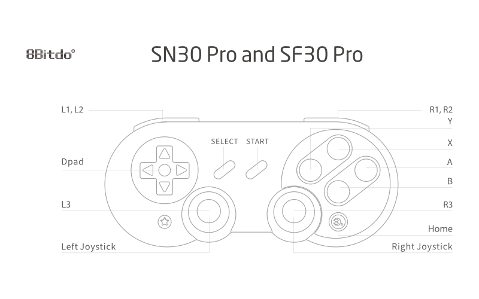
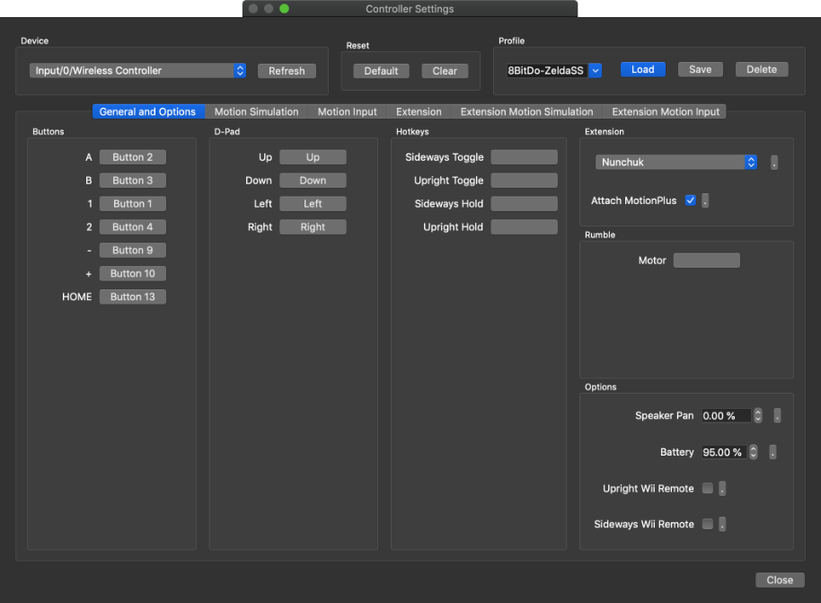
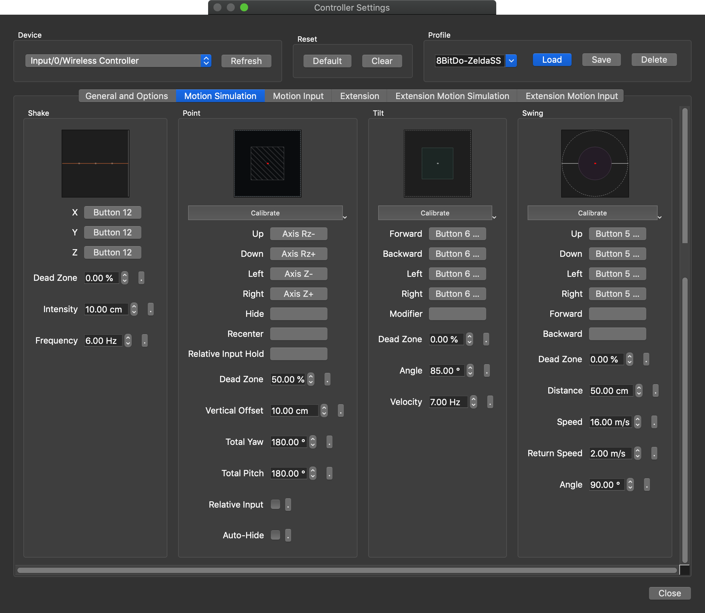
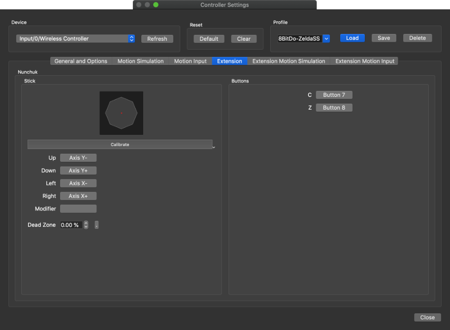
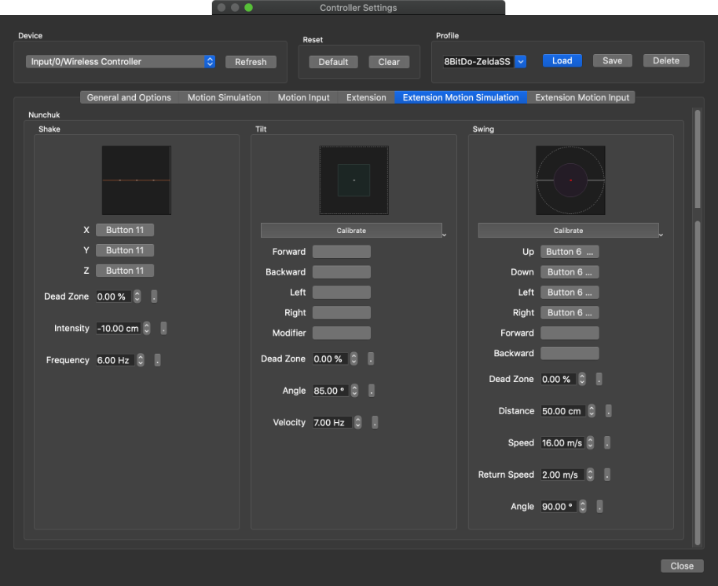

# Dolphin Zelda SS Profile for 8BitDo SN30/SF30 Pro Controller

> Mapping profile for simulated Wiimote Motion Plus playing Zelda Skyward's Sword with an 8BitDo SN30/SF30 Pro Controller under Dolphin emulator

## Quick Links

- [Requirements](#Requirements)
- [Installation](#Installation)
- [8BitDo Keys/Values](#8bitdo-sn30sf30-prod-controls)
- [Dolphin Controller Configuration](#dolphin-mapping-wiimote-motion-plus)
  - [General and Options](#general-and-options)
  - [Motion Simulation](#motion-simulation)
  - [Extension](#extension)
  - [Extension Motion Simulation](#extension-motion-simulation)
- [Game Controls](#game-controls)
- [Credits](#credits)

## Requirements

- [Dolphin v5.0 Build 11836 (development)](https://dolphin-emu.org)
- [8BidDo SN30/SF30 Pro Controller](https://www.8bitdo.com/sn30-pro-g-classic-or-sn30-pro-sn/)

## Installation

`8BitDo-ZeldaSS-profile.ini` should be copied into Dolphin configuration folder

- Linux `~/.config/dolphin-emu/Profiles/Wiimote`
- MacOS `~/Library/Application\ Support/Dolphin/Config/Profiles/Wiimote`
- Windows `?`

## 8BitDo SN30/SF30 Prod Controls

|            | Buttons     |       | Dpad    | Left Stick | Right Stick |
| :--------: | ----------- | :---: | ------- | ---------- | ----------- |
|     A      | `Button 3`  |  Up   | `Up`    | `Axis Y-`  | `Axis Rz-`  |
|     B      | `Button 2`  | Down  | `Down`  | `Axis Y+`  | `Axis Rz+`  |
|     X      | `Button 4`  | Left  | `Left`  | `Axis X-`  | `Axis Z-`   |
|     Y      | `Button 1`  | Right | `Right` | `Axis X+`  | `Axis Z+`   |
|     L1     | `Button 5`  |
|     L2     | `Button 7`  |
|     L3     | `Button 11` |
|     R1     | `Button 6`  |
|     R2     | `Button 8`  |
|     R3     | `Button 12` |
| Start (+)  | `Button 10` |
| Select (-) | `Button 9`  |
|    Home    | `Button 13` |

## Dolphin Mapping Wiimote Motion Plus

> **!!! Do not use calibrate features !!!**

###### General and options

###### Motion Simulation

###### Extension

###### Extension Motion Simulation

## Game Controls

#### Basics

| Action                                |     Key      |             Alt              |
| ------------------------------------- | :----------: | :--------------------------: |
| Move                                  | `Left Stick` |                              |
| Cancel                                |     `A`      |                              |
| Actions (Pick Up, Dash, Dodge ...) |     `B`      |                              |
| Help                                  |     `X`      |                              |
| Inventory                             |     `Y`      |                              |
| Map                                   |   `Start`    |                              |
| Use Item / Quick Equip Wheel          |   `Select`   |          Long Press          |
| Look Around                           |     `L2`     |                              |
| Shield Dash / Forward Roll            |     `L3`     |        while Running         |
| Targetting                            |     `R2`     | Quick Press to center Camera |
| Stabbing                              |     `R3`     |                              |
| Call Fi                               | `D-Pad Down` |                              |

#### Wiimote Modes Togglers

| Action                    | Key  | Alt |
| ------------------------- | :--: | :-: |
| Swing Mode                | `L1` |     |
| Tilt Mode (Swing Motion+) | `R1` |     |

#### Use Sword

| Action          |           Key           |               Alt                |
| --------------- | :---------------------: | :------------------------------: |
| Spin Attack     | `L1 + R1 + Right Stick` |     `Up/Dow` or `Left/Right`     |
| Charge Sword    |    `Right Stick Up`     |                                  |
| Skyward Strikes |   `L1 + Right Stick`    |          After Charging          |
| Vertical Slash  |  `R1 + Left Stick Up`   | Use `Down` to do a Revers Strike |
| Jump Attack     |        `R1 + B`         |          While walking           |

#### When Flying

| Action | Key | Alt |
| ------ | :-: | :-: |
| TODO   |     |     |

#### Others Actions

| Action            |             Key             |        Alt         |
| ----------------- | :-------------------------: | :----------------: |
| Pick up and Throw | `Right Stick Up/Down + L1`  | Use `B` to Pick up |
| Climb Faster      | `L1 + Right Strick Up/Down` |                    |

## Credits

- [Adapted from this topic](https://www.reddit.com/r/DolphinEmulator/comments/chttbu/my_xbox_controller_skyward_sword_controller_map/)
